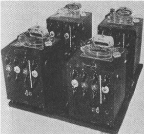

# Note about chapter "Non binary Machine" of the books --> Ways of Being 

## My notes 

**fr**:

**Phrase sortie du texte** :

- "Les idées sur la maniere dont nous devrion penser sont encrées dans notre culture. Ce probléme est exarcerber par la technologie. Une fois qu'une facon de voitr le monde est à été transformer en outils, il est trés difficile de penser autrement : `Quand on à qu'un marteau, tout ressemble à un clou` dit le proverbe."

- "Le probléme est bien plus aigu quand losqu'il s'agit de d'ardinateurs, qui faconne notre sens et notre compréhession du monde bien plus que ne le font les marteau. Nous utilison nos machines sans souvent comprendre ce qu'elle font, et nous accepton sans critique le monde qu'elle nous représentes. Elles en vienne à definir notre notre réaliter et nous faire oublier l'existence d'autre realités. Les ordinateur le font meme par rapport a eux memes. La machine dans lasquelle je tape ces mot est un ordinateur trés spécifique, mais aussi quasi universel. C'est le meme type d'ordinateur que vous avez chez vous, à votre bureau ou dans votre poche. C'est le meme type d'ordinateur, essentiellement, que ceux qui gérent la bourse , prévoie la meteo, pilote les avions, cartographie le genome humain, effectue des recherches sur le webet allume et eteigne les feux de circulation. Toute ces machines partage la meme architecture de base, la meme diposition de processeur et de lma memoire, et parle le meme language de base : Les un et les zero du code binaires."

- "Mais ce n'est pas le seul type d'ordinateur que nous pouvont imaginer ou construire. Cet ordinateur est le resultat d'une chaine trés spécifisue de découverte et de decision - dont certaine reomte à prés de mille ans - qui ont faconnée le fonctionnement de la quasi totalité des ordinateurs existants. Cette acumulation d'idée à aboutie à une formidable uniformité dont la maniere dont nous concevons les ordinateur aujourd'hui - et donc à une uniformité de penser lorsque nous les utilison pour penser. Pour changer notre facon de pencer nous et la facon dont les ordinateur fonctionnes dans nos vie, nous pourrions bien avoir besoin de repenser la forme meme des ordinateur. Ce faisont nous pourrions decouvrir de nouvelles idées et de nouvelles facons d'atteidre le monde plus qu'humain ."

- "Euresemment, il existe de nombreuse autre facon de d'envisager les ordinateurs - de nombreuse branche de l'histoire et leurs conception qui ont été abandoner, ou qui n'on jamais été complétrement explorer, dans la course éfréner vers le seul veritable avenir. L'une des branche les plus intéressante et celle qui a vue le jour a la veille de la seconde guerre mondiale, au moment meme ou l'ordinateur moderne à été concue."

- "La machine de Turing etait une experience de pensée, mais parce qu'elle est devenue la base de toute les formes future de calcul, elle à egalement modifié notre facon de penser."

- "Bien que les machines suivante aient évoler de toute sorte de facon, ce processus de lecture et de stockage, de calcul et de réecréture est toujopur a la base de leur fonctionnement. Presque tout les ordinateur du monde ne sont qu'une version plus élaborer d'une bande de papier et d'une tete de lecture/ecriture. Chaque fois que vous ouvré un mail, que vous taper sur un clavier, que vous retirer de l'argent dans un distributeur, que vous écouter une chanson numérique, que vous regarder un filml en streaming ou que vous voyer a travers d'un sattellite, vous travailler avec une incarnation d'une machine de Turing : des symboles lu et écrit à partir d'une bande de papier. J'écrit ces lignes sur une machione de Turing, il y de forte chance que vous lisier ces lignes sur une machine de turing (et si ce n'est pas le cas, de nombreuse machines ont été necéssaire pour produire ce que vous avez dans vos main)."

- "Ces ordinateur imaginer par turing sont responsable, d'une maniere ou d'une autre, de presque tout les aspet de notre vie. Mais leur omniprésence méme, masque une prise de conscience puissante : presque tout les ordinateurs qui fonctionne aujourd'hui ne représente qu'une infime partie de ce que les ordinateurs pourrait etre. Dans sont article de 1936, Turing qualifie sa machine de `a-machine`, ce qui signifie `machine automatique`. Il fait cette distinction parce qu'il voulais souligner qu'une fois mise en marche, la production de la machine était entierement determiner par sa configuration d'origine. La machine faisait se qu'on lui demmandait et était entierement limité dans ces opération par les données qu'elle contenait. Turing à noté qu'un autre type de machine était possible - une machine a choix ou une machine c - mais que la machine a était tout ce qui etait necessaire pour le type de calculs qu'il cherchaient."

- "Quelques années plus tard, dans sa thèse de doctorat, Turing mentionne à nouveau la machine à choix, sous un autre nom : cette fois, il l'appelle machine à oracle.3 Contrairement à la machine a, qui suit ses instructions sans relâche jusqu'à ce qu'elles soient terminées, cette machine o s'arrête à des moments critiques de son calcul pour "attendre la décision" de ce qu'il appelle "l'oracle"."

- "Turing a refusé de décrire cette entité plus en détail, se contentant de dire que "cela ne peut pas être une machine". Que pouvait-il bien vouloir dire ? Turing avait une idée très claire de ce que seraient les ordinateurs et de ce qu'ils pourraient faire. Les ordinateurs électroniques", écrivait-il, "sont destinés à exécuter n'importe quel processus défini par la règle du pouce qui aurait pu être réalisé par un opérateur humain travaillant de manière disciplinée mais inintelligente".4 En d'autres termes, les a-machines de Turing, les ordinateurs dont nous hériterions tous, feraient ce qu'ils font. Les limites de ces ordinateurs seront les limites de la pensée humaine. Les limites de ces ordinateurs seront les limites de la pensée humaine. En fait, elles en viendraient à la définir."

- "En particulier, ils ont façonné notre idée de la vérité et de la connaissance comme étant ce qui est calculable. Seul ce qui est calculable est connaissable, et notre capacité à penser avec des machines au-delà de notre propre expérience, à imaginer d'autres façons d'être avec elles et à leurs côtés, est donc désespérément limitée. Cette foi fondamentaliste dans la calculabilité est à la fois violente et destructrice : elle enferme dans de petites boîtes ce qu'elle peut et efface ce qu'elle ne peut pas. En économie, elle n'attribue de valeur qu'à ce qu'elle peut compter ; en sciences sociales, elle ne reconnaît que ce qu'elle peut cartographier et représenter ; en psychologie, elle ne donne de sens qu'à notre propre expérience et nie celle d'autres personnes inconnaissables et incalculables. Elle brutalise le monde, tout en nous aveuglant sur ce que nous ne réalisons même pas que nous ne savons pas."

- "Pourtant, dès la naissance de l'informatique, un tout autre type de pensée a été envisagé, et immédiatement écarté : une pensée dans laquelle un autre inconnu est toujours présent, attendant d'être consulté, en dehors des limites du système établi. La machine o de Turing, l'oracle, est précisément ce qui nous permet de voir ce que nous ne savons pas, de reconnaître notre propre ignorance, comme l'a fait Socrate à Delphes. Turing s'est concentré sur la machine a parce qu'il s'intéressait à un aspect du problème : celui de la décidabilité. Il s'agissait d'une question posée par le mathématicien allemand David Hilbert dans son ouvrage influent intitulé Entscheidungsproblem de 1928, qui demandait s'il était possible de construire un processus algorithmique étape par étape pour résoudre ce que l'on appelle les "problèmes de décision". À partir d'une question oui/non, est-il possible d'écrire un ensemble d'instructions garantissant une réponse oui/non ? Turing a conclu que non, mais ce faisant, il a créé un nouveau cadre pour la résolution des problèmes de décision."

- "Mais ce qui m'intéresse, c'est l'indécidabilité. L'indécidabilité a également un sens technique, mais elle a aussi un sens réel, un sens littéral, qui fait référence à ce que nous ne pouvons pas savoir avec certitude. Soucieux de savoir comment penser et comprendre la vie d'êtres radicalement différents des nôtres, et comment nous repenser nous-mêmes dans ce processus, nous pourrions considérer l'indécidabilité non pas comme un obstacle à la compréhension, mais comme un signe, un indice, un parfum de truffe, indiquant que quelque chose d'intéressant, voire d'utile, est à portée de main."

- "L'un des plus grands malentendus du vingtième siècle, qui persiste encore aujourd'hui, était que tout n'était en fin de compte qu'un problème de décision. L'apparition des ordinateurs a été si merveilleuse et leurs capacités si puissantes qu'elle nous a convaincus que l'univers est comme un ordinateur, que le cerveau est comme un ordinateur, que nous, les plantes, les animaux et les insectes sommes comme des ordinateurs - et le plus souvent, nous oublions le "comme". Nous considérons le monde comme une chose à calculer, et donc susceptible d'être calculée. Nous le considérons comme quelque chose qui peut être décomposé en points discrets de données et alimenté par des machines. Nous pensons que la machine nous donnera des réponses concrètes sur le monde, sur lesquelles nous pourrons agir, et confère à ces réponses une irréfutabilité logique et une impunité morale."

- "Le monde n'est pas comme un ordinateur. Les ordinateurs - comme nous, comme les plantes et les animaux, comme les nuages et les mers - sont comme le monde. Certains plus que d'autres, certains mieux adaptés à ses processus - et beaucoup moins. L'intelligence artificielle des entreprises, la stupidité artificielle et toutes les autres formes débiles que nous avons créées au fil des ans - les bases de données qui trient et échouent, les marchés boursiers qui s'effondrent et s'appauvrissent, les algorithmes qui surveillent et jugent - ont ceci en commun. Ce sont des machines à décider : elles tentent de dominer le monde en en faisant des modèles et en prenant des décisions basées sur ce modèle. Faire un modèle, c'est abstraire et représenter : c'est un acte de distanciation par rapport au monde. Mais le monde est déjà là, il est devant nous. Nous y sommes suspendus et nous en sommes imprégnés : nous en sommes inséparables."

- "Les machines dont nous avons besoin pour donner un sens à ce monde omniprésent, efflorescent et enchevêtré - où donner un sens est analogue, comme l'a dit Wittgenstein à propos du langage, à participer à un jeu - ne devraient pas être plus éloignées, plus abstraites, mais plus proches du monde."

- "Parmi les premières et les plus adorables de ces machines figurent les petits robots construits par le neurophysiologiste William Grey Walter à l'Institut neurologique Burden de Bristol à la fin des années 1940. Ces robots étaient de petits automates à roues, dotés d'une carapace dure, qui se déplaçaient et se cognaient dans la pièce et qui, grâce à l'ingéniosité de Walter, modifiaient leur comportement en fonction de leur âge."

- "Il les a appelés Machina speculatrix, désignant une nouvelle espèce de machine, mais elles sont plus connues sous le nom de tortues. Des capteurs situés sous leur carapace enregistrent les chocs avec des objets et les font repartir dans une autre direction. De cette manière, elles se déplaçaient de manière aléatoire et trouvaient le moyen de contourner divers obstacles. Le premier couple de tortues, que Walter a appelé Elmer et Elsie, était également équipé de capteurs de lumière. Cela leur conférait une capacité observée chez de nombreux animaux, appelée phototaxie, c'est-à-dire une attirance vers la lumière. Comme les papillons de nuit et les méduses, les tortues se déplacent vers la source de lumière la plus proche et la plus puissante, ce qui leur permet d'être guidées dans la pièce à l'aide d'une torche ou de retourner dans leur "niche" bien éclairée pour se recharger lorsque leur batterie est déchargée."

- "Walter a comparé les deux capteurs - lumière et mouvement - à deux neurones, constituant un minuscule cerveau. Pourtant, les interactions dynamiques entre ces deux neurones de base étaient suffisantes pour produire une série de comportements complexes, ou ce que Walter a décrit comme `l'incertitude, le hasard, le libre arbitre ou l'indépendance qui sont si manifestement absents de la plupart des machines bien conçues`"

- "Par exemple, les capteurs de lumière primitifs de la tortue étaient facilement surchargés, ce qui signifie que les lumières les plus vives la repoussaient. Elles commençaient donc par se diriger vers une source lumineuse, puis reculaient lorsqu'elles s'en approchaient de trop près, puis avançaient à nouveau, et ainsi de suite. Ils tournaient ainsi autour des lampes dans un schéma nerveux et bégayant d'approche et de recul."

- "La capacité la plus frappante des tortues a été produite de manière tout à fait inattendue par l'ajout d'un petit écran lumineux sur leur dos, destiné à indiquer que leur moteur était en marche. Immédiatement, les machines ont affiché un nouveau comportement : à l'approche d'un miroir ou d'une autre surface réfléchissante, elles apercevaient leur propre lumière et commençaient immédiatement à se secouer devant leur propre reflet `d'une manière si spécifique`, écrit Walter, `que si c'était un animal, un biologiste serait justifié de lui attribuer une capacité d'autodiscipline`."

- "Vingt ans avant sa définition officielle, les tortues ont passé le test du miroir. Walter opposait ses tortues aux premiers ordinateurs, qui, ne connaissant qu'un langage de uns et de zéros et dépourvus de sens au-delà de l'entrée directe de données, étaient, selon lui, "en aucun cas libres comme le sont la plupart des animaux;"

- "Cette idée, selon laquelle la technologie pourrait être capable de s'adapter à son environnement, était au cœur de la cybernétique, un domaine d'étude né après la Seconde Guerre mondiale et qui, depuis lors, a rassemblé un groupe hétéroclite de scientifiques, de chercheurs, de psychiatres, d'artistes et d'énergumènes sous son égide. Définie en 1948 comme "l'étude scientifique du contrôle et de la communication chez l'animal et dans la machine", la cybernétique a par la suite traversé les disciplines, influençant les études sur l'apprentissage, la cognition, l'auto-organisation, la rétroaction biologique, la robotique et la gestion d'entreprise, sans jamais se fondre dans un discours fixe ou s'installer confortablement dans un milieu universitaire unique département."

- "Cet appareil avait été conçu quelques années plus tôt par un autre psychiatre anglais, W. Ross Ashby, qui a souvent décrit sa création comme un cerveau artificiel. En fait, l'homéostat consistait en un ensemble de quatre unités de contrôle de bombes de la Royal Air Force, câblées ensemble pour réagir aux entrées et sorties de chacune d'entre elles. Ces unités avaient été développées pendant la guerre en tant que dispositifs de rétroaction automatisés, qui réagissaient à un signal entrant en augmentant ou en diminuant un autre signal."

- 

- "Lorsqu'il a relié quatre de ces unités entre elles, Ashby a constaté qu'elles essayaient d'ajuster leurs paramètres jusqu'à ce qu'elles atteignent une sorte de stabilité les unes par rapport aux autres - leurs entrées et leurs sorties fluctuant jusqu'à ce qu'elles parviennent à l'équilibre. En outre, lorsque l'une d'entre elles était perturbée, l'ensemble du système se réajustait jusqu'à ce que la stabilité soit rétablie. Ashby a appelé cette capacité "ultrastabilité adaptative". Quoi que fassent ses collègues pour perturber la machine - en intervertissant les connexions, en inversant les fils positifs et négatifs, en attachant ensemble les bras magnétiques oscillants ou en bloquant leur mouvement - l'ultrastabilité s'est maintenue. a toujours retrouvé un état stable."

- "C'est cette capacité à s'autocorriger et à trouver de nouveaux modèles stables qui a conduit Ashby à décrire ces unités comme des sortes de cerveaux artificiels : il les a en effet comparées à l'esprit non développé d'un chaton. Lorsqu'il est jeune, le chaton ne sait pas que la viande rouge est bonne et que le feu rouge est mauvais, mais les réactions positives et négatives le remettent rapidement dans le droit chemin, créant ainsi un modèle de comportement mémorisé."

- "Walter (Grey Walter) a été impressionné par l'homéostat, mais il l'a trouvé limité, "comme une créature endormie qui, lorsqu'elle est dérangée, s'agite et trouve une position confortable".11 Contrairement à l'homéostat, ses tortues étaient mobiles et exploratrices : elles n'attendaient pas que leur équilibre soit rompu, mais se déplaçaient à la recherche de problèmes."

- "Pour programmer une machine, il suffit de lancer dans le monde un système capable de réagir de façon nouvelle et de le laisser s'adapter. C'était le principe central de la cybernétique : s'adapter au monde était une approche plus puissante et plus appropriée que d'essayer de l'anticiper et de le contrôler."

- "L'intérêt de l'homéostat et des tortues est qu'ils s'adaptent à leur environnement au fur et à mesure qu'ils le rencontrent. Combien de fois est-ce l'objectif de nos technologies ? Nous considérons la technologie avant tout comme une solution aux problèmes auxquels nous sommes confrontés (y compris, trop souvent, ceux que nous avons créés). Mais Walter, Ashby et les autres cybernéticiens de la première heure voyaient la technologie comme quelque chose de très différent : quelque chose doté de sa propre agence et de ses propres capacités, dont les réactions étaient incertaines et dont le comportement devait refléter ses propres rencontres avec le monde."

- "Pour certains, le critère essentiel pour déterminer si une machine est ou non un `cerveau` serait de savoir si elle peut ou non `penser`. Mais pour le biologiste, le cerveau n'est pas une machine à penser, c'est une machine à agir."

- "Comme le dit l'historien de la cybernétique Andrew Pickering : L'étrangeté de la cybernétique apparaît ici clairement."

- "elle se préoccupe de la manière dont la boîte fonctionne et des relations qui se forment lorsqu'elle entre en jeu avec le monde. La cybernétique ne se préoccupe pas de ce qui se trouve dans la boîte noire : elle se préoccupe de la manière dont la boîte fonctionne et des relations qui se forment lorsqu'elle entre en jeu avec le monde. En tant que telle, c'est une façon de penser à des esprits plus qu'humains qui correspond étroitement à notre rejet de la pensée hiérarchique, anthropocentrique et "intelligente" et à notre volonté d'améliorer la qualité de notre vie. de l'être agentiel et relationnel."

- "S'appuyant sur les travaux d'Ashby et de Walter, Beer (Stafford Beer) a mené des recherches approfondies sur d'autres méthodes de construction de machines, des méthodes qui permettraient une réponse rapide, un retour d'information, un changement et une adaptation. Le résultat est l'une des œuvres les plus étranges du XXe siècle, dans laquelle des expériences bizarres avec des intelligences autres qu'humaines ont été menées au cœur de l'industrie britannique traditionnelle et à la pointe de la politique radicale."

- "Beer s'est vu confier la tâche d'automatiser l'une de ses usines. Beer pensait que l'un des moyens de réaliser cet exercice d'équilibre était d'utiliser le dispositif de rétroaction d'Ashby, l'homéostat - représenté par les flèches en boucle au bas d'un diagramme que Beer a publié sur l'usine cybernétique. Beer pensait que l'un des moyens de parvenir à cet équilibre était d'utiliser le dispositif de rétroaction d'Ashby, l'homéostat - représenté par les flèches en boucle au bas d'un diagramme de l'usine cybernétique publié par Beer en 1962. Intégré dans un réseau de capteurs et d'effecteurs, l'homéostat devait constamment aligner les différentes entrées et sorties de manière plus efficace et plus productive, et reconfigurer ses processus en conséquence. Beer a désigné ce cerveau cybernétique sous le nom d'U- Machine."

- "Comment concevoir une machine qui répondra à des situations entièrement nouvelles, lorsque le système d'information de l'entreprise ne sera pas en mesure de répondre aux besoins de l'utilisateur ?"

- "En tant que constructeur de machines, l'homme a pris l'habitude de considérer ses matériaux comme des morceaux de matière inertes qu'il faut façonner et assembler pour en faire un système utile". Mais nous ne voulons pas d'un grand nombre de pièces et de morceaux que nous devons assembler. Parce qu'une fois que nous nous sommes mis d'accord sur ce point, nous devons avoir un plan. Nous devons concevoir cette satanée chose, et c'est précisément ce que nous ne voulons pas faire.

- "Beer reprend directement la description de la machine-oracle de Turing : cette entité non spécifiée qui ne peut pas être une machine. Plus précisément, la définition de Beer est la clé pour comprendre ce que Turing voulait dire : l'o-machine ne peut pas être une machine, parce qu'une machine est une chose conçue dans un but explicite, et donc incapable de s'adapter à des situations nouvelles."

- "La U-machine et la o-machine sont en fait la même chose. Lorsqu'ils sont confrontés à la nécessité de prendre des décisions sur des choses trop complexes ou trop nouvelles pour être calculées ou interprétées à partir de l'expérience existante, Beer et Turing recherchent tous deux quelque chose qui dépasse la machine telle que nous la concevons, quelque chose qui découle d'un état d'inconnaissance et qui est capable de fonctionner dans cet état d'inconnaissance."

- "Nous avons tendance à considérer le monde comme un endroit que l'on peut connaître et donc contrôler et dominer. Nous y parvenons par le calcul, par l'acquisition et le traitement de données, par la construction de bases de données de plus en plus grandes et d'ordinateurs de plus en plus puissants. Mais Beer pensait qu'il existait dans le monde une catégorie de "systèmes extrêmement complexes" qui étaient en principe inconnaissables. Ces systèmes comprennent le cerveau, l'entreprise et l'économie. Il a donc entrepris de construire des machines capables de fonctionner face à cette inconnaissance, un voyage qui l'a conduit à des situations très étranges."

- "Les outils extraordinairement complexes que nous avons développés au cours des années qui ont suivi la conception de l'usine automatique représentent l'accumulation de quantités extraordinaires de connaissances - mais nous ne sommes pas plus près de résoudre le monde. En fait, c'est le contraire qui est vrai : dans nos tentatives d'affirmer l'ordre et d'établir la vérité sur l'extrême complexité du monde, nos incertitudes  semblent s'être multipliées, laissant la plupart d'entre nous paralysés, effrayés, en colère et soumis à des systèmes d'oppression et de contrôle de plus en plus opaques."

- "L'homéostat est une machine à gérer l'inconnu. Lorsqu'il est confronté à des circonstances nouvelles, il se reconfigure de manière appropriée. Mais surtout, il le fait sans avoir à comprendre la nature du changement : il est performatif et non représentatif. Elle vit dans le monde, un monde qu'elle ne cherche pas à connaître, mais auquel elle s'adapte. C'est ce que Beer voulait que son usine fasse. La solution de Beer au problème de l'absence de construction d'un cerveau a été d'en attirer un à partir du monde naturel. Dès les années 1950, il raconte avoir réussi à enseigner à de jeunes enfants (les siens, espérons-le, bien que ses articles ne le précisent pas) à résoudre des équations simultanées, alors qu'ils ne connaissaient aucune des mathématiques correspondantes. Il y est parvenu grâce à une rétroaction positive et négative, la méthode de l'homéostat : il leur a montré des lumières colorées correspondant à des réponses "plus chaudes" et "plus froides" jusqu'à ce qu'ils saisissent la bonne réponse. Pour lui, c'était la preuve que des esprits "simples" pouvaient s'adapter à de nouveaux problèmes sans enseignement spécifique - l'essence même de la performativité cybernétique par rapport à la connaissance et à la compréhension enracinées. C'est ainsi qu'il a commencé à essayer avec d'autres animaux."

- "Il a schématisé des boîtes interconnectées, avec des échelles, des bascules et des cages reliées par des poulies, qui permettaient aux rats ou aux pigeons de faire partie de dispositifs informatiques élaborés. Les abeilles, les termites, les fourmis et d'autres insectes ont tous été envisagés pour jouer un rôle dans cette notion élargie d'ordinateur biologique. Cependant, ces expériences sont restées des expériences de pensée, et Beer n'a fait que les résumer dans ses écrits. Il a consacré beaucoup plus de temps et d'efforts à une conception beaucoup plus large du cerveau artificiel : un écosystème entier."

- "Beer a construit dans le sous-sol de sa maison un grand réservoir qu'il a rempli d'eau provenant d'étangs de la campagne environnante. Lentement, le réservoir se remplit de toutes sortes de vie aquatique sauvage : roseaux et algues, nématodes et sangsues. Si les esprits individuels sont capables de s'adapter sans le savoir, les communautés d'esprits, aussi minuscules ou différentes soient-elles, doivent être capables d'une adaptation encore plus souple et sauvage. C'est ainsi qu'il a tenté de convoquer une telle communauté à l'existence.17 Ses premières tentatives d'économie de la vie dans les étangs se sont appuyées sur les Euglena : des créatures unicellulaires microscopiques bien connues de la science pour leur possession, non animale, de chloroplastes photosynthétiques - un exemple de premier ordre."

- "Les euglènes sont très sensibles à la lumière et se dirigent vers elle de la même manière que les tortues de Walter. Pour tirer parti de cette capacité rare, Beer a suspendu dans l'eau de leur réservoir des lampes qui pouvaient être allumées ou éteintes en fonction de divers signaux. Il espérait ainsi que les euglènes pourraient être "connectées" à un système automatisé plus vaste, réagissant aux changements à l'extérieur de l'aquarium en se déplaçant vers différentes lumières, et que leur comportement pourrait être utilisé à son tour pour influencer le comportement du système dans son ensemble."

- "L'idée de Beer était que si ces deux systèmes - l'étang et l'usine - pouvaient être mis en relation, des changements dans l'un déclencheraient des changements dans l'autre. Les améliorations apportées au fonctionnement de l'usine perturberaient l'équilibre dynamique de l'étang, qui se reconfigurerait dans un nouvel état, entraînant l'usine avec lui, jusqu'à ce qu'un nouveau super-équilibre soit trouvé entre les deux systèmes. C'était l'ultrastabilité homéostatique à l'œuvre. Malheureusement, les euglènes ne semblaient pas être prêtes pour cela : après un court laps de temps, elles "se couchaient", comme l'a dit Beer, et refusaient de coopérer."

- "Dans une autre tentative, Beer s'est concentré sur les daphnies, ou puces d'eau : de minuscules crustacés qui abondent également dans les étangs britanniques. Beer a enduit des feuilles mortes de limaille de fer et les a fait flotter dans l'étang, où elles ont été mangées par les daphnies. Les petits acariens sont alors devenus sensibles au magnétisme et ont pu être poussés à l'aide d'électro-aimants, diffusant des données en provenance de l'usine. En essayant de trouver un point d'équilibre dans les ondes magnétiques changeantes qui ondulent dans l'eau, les acariens ont adopté des comportements adaptatifs."

- "Les résultats de l'expérience ont été mesurés et renvoyés à l'usine, créant ainsi de nouvelles boucles de rétroaction. Une fois de plus, cependant, Beer s'est heurté à des difficultés expérimentales : lorsque les daphnies ont commencé à excréter le fer qu'elles avaient avalé, l'eau est devenue rouillée et l'"organisation naissante" de l'étang a commencé à se désagréger."

- "L'un des problèmes que pose la description que nous avons faite jusqu'à présent du cerveau cybernétique et artificiel comme un type de cerveau différent - qu'il s'agisse d'un homéostat, d'une tortue mécanique, d'une souris entraînée ou d'un cadre moyen dans un bocal - est que nous essayons sans cesse de l'enfermer dans un autre système, tout comme nos propres cerveaux sont enfermés dans nos têtes. Mais une colonie d'Euglena - et encore moins un étang entier - n'est pas une machine individuelle, c'est un système à part entière : un écosystème, un riche mélange, un assemblage diversifié de vie en soupe."

- "Le problème de l'intelligence artificielle et de l'usine cybernétique réside peut-être dans le fait que nous avons essayé d'enfermer un cerveau dans la machine, alors que le véritable cerveau - l'oracle - se trouve à l'extérieur. L'oracle est le monde. Nous avons tout pris à l'envers. Nous pensons que toute l'activité se situe à l'intérieur - lorsque nous introduisons des électrodes dans le cerveau des chimpanzés et des mouches à fruits, ou que nous dépouillons les plantes jusqu'à leurs racines et leurs nodules, par exemple - mais la véritable action se situe à l'extérieur, dans le monde. C'est là que tout naît et agit. La vie se produit lorsque tout rebondit sur tout le reste."

- "C'est probablement le moment de souligner que la Terre elle-même est un homéostat. C'est du moins le principe central de la théorie Gaïa de James Lovelock et de Lynn Margulis - oui, Gaïa, la même déesse qui était vénérée à Delphes, la maison de l'oracle. Bien sûr, tout cela vient en chatoyant, en se heurtant et en se concertant au fil des éons. La théorie de Gaïa conçoit le monde comme un système synergique, autorégulé et complexe dans lequel les matières organiques et inorganiques interagissent les unes avec les autres pour coproduire les conditions nécessaires à la vie sur Terre. Gaia est un système de rétroaction cybernétique, la réalisation de l'usine cybernétique de Beer à l'échelle planétaire, dans laquelle les entrées et les sorties sont l'eau, l'air et la roche, et la machine en U est l'ensemble de la biosphère qui se gonfle, se gonfle, se tortille, croît et s'adapte. Le monde n'est pas comme un ordinateur ; les ordinateurs sont comme le monde."

- "Cette prise de conscience ouvre la voie à toutes sortes de possibilités informatiques passionnantes et radicalement différentes, que Beer avait à peine anticipées mais qu'il aurait probablement beaucoup appréciées. Nombre d'entre elles sont regroupées dans la catégorie floue de l'"informatique non conventionnelle", qui s'inspire du mantra selon lequel tout ce qui peut être fait électroniquement peut probablement être fait de manière plus intéressante avec ... eh bien, n'importe quoi d'autre. L'informatique non conventionnelle naît de la même impulsion que la programmation ésotérique et tente de réaliser dans le matériel - ou wetware - le même genre d'astuces que l'écriture d'un logiciel dans le style d'un orang-outan fictif."

- "L'une des vedettes de l'informatique non conventionnelle, successeur moderne de la daphnie de Beer, est la moisissure visqueuse, elle-même une catégorie d'organismes assez floue que les scientifiques ne savent pas vraiment où situer. L'une des caractéristiques les plus remarquables des moisissures visqueuses est qu'elles troublent le clivage individu/groupe, existant parfois en tant qu'organismes unicellulaires indépendants, comme l'Euglena, et à d'autres moments - en particulier lorsque la nourriture est rare ou que les conditions sont difficiles - essaimant en grappes qui fonctionnent collectivement. Dans certains cas, ces groupes fusionnent pour produire de grands sacs de cytoplasme remplis de milliers de noyaux. Lorsqu'elles veulent se reproduire, certaines parties du collectif forment des spores, qui sont ramassées par le vent ou les animaux ; d'autres se sacrifient pour devenir des infrastructures non reproductives, les pédoncules et les tiges du corps fructifère. Ils ont aussi d'autres astuces. Séparées, elles peuvent se retrouver et se reconstituer. Elles peuvent anticiper les événements : comme le Mimosa, elles semblent conserver la mémoire des épisodes défavorables et réagir en conséquence. Autrefois classées parmi les champignons, les moisissures visqueuses ont pris, à y regarder de plus près, une sorte d'apparence de "champignon"."

- "Ils ont une individualité bizarre et communautaire et, comme la discipline cybernétique elle-même, ils refusent continuellement de s'installer dans un nouveau domaine."

- "En 2010, une moisissure visqueuse appelée Physarum polycephalum s'est révélée être un urbaniste très efficace en recréant l'un des réseaux de transport les plus robustes et les plus efficaces au monde. Le réseau ferroviaire japonais est un chef-d'œuvre d'ingénierie complexe, qui a nécessité des décennies de travail de la part des concepteurs et des planificateurs, et qui repose sur des compromis complexes entre les coûts, les ressources et la géographie."

- "Il s'agit d'un réseau très efficace de distribution des nutriments entre des "stations" éloignées, avec des routes principales plus solides et plus résistantes reliant les centres. Il ne s'agissait pas non plus d'un simple exercice d'assemblage de points, mais d'une carte réaliste où les zones de lumière vive - que le Physarum n'aime pas - correspondaient à des montagnes et à des lacs, ce qui obligeait le moule à faire le même genre de compromis que les ingénieurs doivent mettre en œuvre. Après une journée passée à s'adapter à son environnement, la ressemblance avec une carte réelle du Grand Tokyo s'est confirmée."

- "Malgré les centaines d'années pendant lesquelles les mathématiciens se sont penchés sur le problème et les investissements considérables réalisés par les entreprises de logistique et les services postaux, il n'existe aucun moyen garanti de trouver la meilleure réponse à cette énigme, quelle que soit la manière dont on la formule. Pire encore, à mesure que de nouvelles villes s'ajoutent à la liste, le problème devient exponentiellement plus difficile, car le nombre d'options se multiplie. Cette croissance explosive des solutions possibles est un énorme problème pour les algorithmes mathématiques, qui peuvent se perdre dans un labyrinthe d'impasses et de mauvaises réponses. C'est pourquoi le problème du voyageur de commerce est un exemple classique de problème qu'une machine de Turing universelle - la a-machine - ne peut pas résoudre de manière fiable. Il est indécidable du point de vue informatique. Et que disions-nous à propos de l'indécidabilité ? L'heure de la o-machine a sonné."

- "En 2018, la même moisissure visqueuse, Physarum polycephalum, a montré qu'elle était capable de résoudre le problème du voyageur de commerce en temps linéaire, ce qui signifie qu'à mesure que la taille du problème augmentait, elle continuait à prendre les décisions les plus efficaces à chaque étape. Utilisant la même méthode que l'expérience sur les trains de Tokyo, des chercheurs de l'université de Lanzhou, en Chine, ont placé des restes de nourriture à la place des villes et ont utilisé des faisceaux de lumière pour empêcher le problème de se répéter Les chercheurs ont montré que le moule ne mettait que deux fois plus de temps à résoudre une carte de huit villes que de quatre villes.21 Ils ont montré que la moisissure mettait deux fois moins de temps à résoudre une carte de huit villes qu'une carte de quatre villes, bien qu'il y ait presque mille fois plus d'itinéraires possibles.22 En bref, la moisissure visqueuse a facilement accompli une tâche pour laquelle les ordinateurs les plus puissants du monde - et les humains - sont absolument nuls."

- "L'idée que les systèmes biologiques pourraient non seulement remplacer, mais aussi surpasser de nombreuses opérations des ordinateurs - qui surpassent déjà les capacités humaines - s'inscrit dans notre proposition selon laquelle les ordinateurs sont comme le monde, et non l'inverse. Mais pour assimiler cette idée, nous devons effectuer lemême type de retournement mental que lorsque nous parlons de réseaux fongiques et d'internet, ou d'intelligence humaine et animale. Les systèmes intelligents et informatiques - les réseaux mycorhiziens, les moisissures visqueuses et les colonies de fourmis, pour n'en citer que quelques-uns - ont toujours existé dans le monde naturel, mais nous avons dû les recréer dans nos laboratoires et nos ateliers avant d'être capables de les reconnaître ailleurs."

- "Nous avons besoin des modèles mentaux fournis par notre technologie, des mots que nous inventons pour ses concepts et ses métaphores, afin de décrire et de comprendre correctement que des processus analogues sont déjà à l'œuvre dans le monde plus qu'humain."

- "Le memristor est une résistance dotée d'une mémoire, ce qui lui permet de se souvenir de son propre état - de conserver des données - même lorsqu'elle n'est pas alimentée. Si les memristors étaient utilisés à l'intérieur des ordinateurs, ils supprimeraient la division stockage-processeur commune à tous les ordinateurs modernes et augmenteraient considérablement leur efficacité et leur puissance, transformant ainsi le calcul."

- "Les chercheurs du laboratoire d'informatique non conventionnelle de l'université de l'ouest de l'Angleterre, dirigés par le professeur Andrew Adamatzky, ont montré que le Physarum présente un comportement similaire à celui d'un memristor : lorsqu'il est chargé avec certaines tensions, il présente le même comportement lors des tests suivants. En d'autres termes, il se souvient de son état précédent, comme un memristor. Ainsi, il devrait être possible de construire un ordinateur radicalement rapide et efficace à partir de moules de bave, déposés sur un substrat comme une puce de silicium."

- "Depuis que l'on s'est rendu compte que la moisissure visqueuse pouvait agir comme un memristor, on a constaté qu'il en allait de même pour de nombreux autres organismes. Le piège à mouches de Vénus, l'Aloe vera et un autre vieil ami, Mimosa pudica, ont tous fait preuve d'un comportement mémoriel. En fait, il semble de plus en plus évident que toutes les plantes vivantes, ainsi que la peau, le sang et les canaux sudoripares des corps animaux (y compris le nôtre), sont des mémoires potentielles. Il ne reste plus qu'à trouver comment intégrer de telles structures dans notre technologie afin de concevoir de nouveaux types d'ordinateurs, qui pourraient surpasser en capacité toutes les machines que nous avons construites jusqu'à présent."

- "Néanmoins, il s'agirait toujours du même type d'ordinateurs : les mêmes vieilles machines de Turing avec une architecture très différente. Et si, au lieu de dépouiller les autres organismes de leurs composants utiles, de les traiter comme autant de pièces détachées pour nos machines, nous les intégrions en bloc et, au-delà, commencions à considérer l'environnement lui-même comme faisant partie de notre substrat informatique ?"

- "le physicien Edward Fredkin et l'ingénieur Tommaso Toffoli ont montré qu'il était possible de modéliser les opérations des portes logiques en utilisant le mouvement des boules de billard. Imaginez une table de billard avec deux poches à une extrémité et deux tubes inclinés à l'autre. Une boule lâchée dans l'un ou l'autre des tubes roulera sans être dérangée dans l'une des poches - la même poche, pour l'un ou l'autre des tubes. Mais si deux boules sont lâchées en même temps, elles se heurteront l'une l'autre et l'une d'entre elles ricochera dans la seconde poche. Il s'agit d'un exemple de porte ET, un type de circuit qui combine les signaux entrants, la première poche représentant une sortie de zéro (une seule entrée) et la seconde une sortie de un (les deux entrées). Avec suffisamment de portes ET, on peut fabriquer n'importe quel autre type de porte. Ainsi, avec suffisamment de tables de billard, on peut fabriquer n'importe quel type de circuit numérique."

- "des chercheurs ont recréé la porte de la boule de billard ET en utilisant des crabes : le crabe soldat Mictyris guinotae, plus précisément, qui est endémique aux lagons peu profonds des îles Ryukyu du Japon. Ces petits crabes bleus sont connus pour former d'énormes armées qui déferlent sur les lagons à marée basse. Bien qu'ils comptent de plusieurs centaines à plusieurs milliers d'individus, ces essaims apparemment chaotiques ont une dynamique tout à fait prévisible. Les crabes situés à l'avant de l'essaim se déplacent vers l'avant (ou, probablement, sur le côté) en formation serrée ; ceux du milieu suivent leurs voisins ; et ceux des bords se replient continuellement vers le centre, créant un mouvement de roulement - un peu comme une boule de billard. Les mouvements de ces essaims peuvent être contrôlés à l'aide de tunnels ou, plus ingénieusement, d'ombres, que les crabes n'aiment pas parce qu'elles leur font penser à des oiseaux prédateurs."

- "Lorsque deux essaims entrent en collision, ils se dirigent vers un nouvel angle (prévisible) - encore une fois, comme une boule de billard."

- "Les informaticiens non conventionnels de Kobe ont placé quarante crabes soldats dans un labyrinthe et les ont effrayés avec des ombres. Les essaims roulants qui en ont résulté se sont comportés exactement comme l'ordinateur à boules de billard, s'écrasant les uns contre les autres de manière prévisible, tournant dans des directions prévisibles et simulant des opérations logiques. Un ordinateur fait de crabes."

- "Comme la robotique molle utilise des systèmes de motorisation totalement différents, elle est beaucoup plus difficile à contrôler. Certains se musclent, c'est-à-dire qu'ils dilatent ou compriment certaines parties de leur corps pour se développer dans différentes directions, comme une plante ou un animal."

- "L'une des solutions proposées consiste à déléguer le contrôle de ces membres souples par le biais d'un processus appelé "informatique de réservoir", dans lequel l'intention globale du système est envoyée à un sous-ensemble de neurones artificiels, qui déterminent comment atteindre l'intention souhaitée au niveau local. Il s'agit essentiellement d'utiliser un système complexe pour en faire fonctionner un autre, ce qui ressemble beaucoup à l'usine cybernétique de Beer, jusqu'au "réservoir" ou à l'étang. Cela ressemble aussi beaucoup à ce que nous pensons que les pieuvres et autres céphalopodes font, avec leurs systèmes neuronaux distribués et leurs membres apparemment autonomes.27 La robotique douce et l'informatique de réservoir ressemblent davantage à de la bio-mimétique qu'à de l'informatique véritablement biologique, car malgré toutes les allusions aux membres et aux neurones, les systèmes utilisés sont entièrement construits artificiellement. Mais selon l'esprit cybernétique, il est possible d'appliquer les mêmes idées au monde lui- même. Un groupe de chercheurs a même porté le terme "informatique de réservoir" à son plus haut niveau."

- "Qu'est-ce que cela signifie ? Ce qu'ils ont fait, c'est placer plusieurs moteurs sur le bord d'un récipient d'eau, ce qui permettait de créer des ondes - des modèles d'interférence - à la surface de l'eau. Ce dispositif a ensuite été placé sur un rétroprojecteur, afin que les ondes puissent être observées comme des motifs de lumière et d'obscurité sur le mur. Des données différentes, transmises aux moteurs, produisaient des motifs différents sur le mur, et ces motifs étaient ensuite analysés par un ordinateur (à base de silicium) utilisant l'apprentissage automatique. Lors d'une expérience, le seau a été alimenté avec des échantillons de différents mots parlés, et l'ordinateur a rapidement appris à les différencier. Il a appris à reconnaître les qualités de la parole, ce qui est un problème notoirement difficile, et il l'a fait avec beaucoup plus de précision que lorsqu'on lui présentait uniquement des données numériques brutes, de la même manière que la moisissure visqueuse a résolu le problème du voyageur de commerce plus efficacement que n'importe quel ordinateur numérique. L'eau semble prétraiter les informations complexes en les transformant d'informations binaires unidimensionnelles en informations plus complexes, mais plus expressives, à plus haute dimension : une danse fluide. De plus, contrairement à la daphnie magnétique, par exemple, qui a rapidement rouillé l'eau, l'arrêt des moteurs a immédiatement "réinitialisé" le seau à son état initial, ce qui lui a permis d'envisager un nouveau problème. Deux points méritent d'être soulignés. Le premier est que ce système - que les chercheurs appellent une machine à état liquide - pourrait ressembler davantage au type de traitement de l'information qui se produit dans les  Les neurones biologiques, dans lesquels des informations incroyablement complexes semblent être facilement traitées par des circuits très simples. Le calcul neuronal - le traitement du monde par le cerveau - est peu rapide et peu précis comparé à un ordinateur, mais il est aussi massivement parallèle et en temps réel, fonctionnant plus comme le flux d'une rivière que comme le tic-tac d'une horloge. Comme notre cerveau a évolué pour s'interfacer avec le monde tel qu'il est, cela suggère que la résolution des problèmes du "monde réel" - recherche d'itinéraires, reconnaissance vocale, économie - est mieux traitée par des ordinateurs qui ressemblent davantage au monde."

- "Deuxièmement, l'eau dans le seau n'est pas en train de "penser" ou de "se souvenir", mais elle est en train de traiter. Elle calcule des informations. La forme de cette information ne ressemble pas aux uns et aux zéros qui passent par les machines numériques (y compris l'ordinateur crabe) : elle est analogique, ce qui, au lieu d'être vieux ou flou, signifie complexe, noueux et continu. Elle a une texture et une couleur, comme le monde. Pour être clair, il ne s'agit pas d'un appel nostalgique et ringard à préférer les vinyles aux MP3. Il ne s'agit pas d'essayer de représenter ou de reproduire le monde d'une manière particulière, selon nos préférences esthétiques ou intellectuelles. Il s'agit simplement de reconnaître que le monde nous est activement inconnaissable, contrairement à la manière dont l'informatique numérique tente de rendre le monde connaissable. Nous ne pouvons pas lire l'eau de la même manière que les données, et c'est une bonne chose. Travailler avec l'eau nous rend plus conscients de la distance qui nous sépare de la matière considérée : elle nous rappelle que nous partageons ce monde plutôt que de le posséder. La connaissance produite par le biais de la surface mouvante d'un seau d'eau se fait en coopération avec le monde, plutôt qu'en le conquérant."

- "Le meilleur exemple de l'ordinateur hydraulique en tant qu'outil pédagogique - en tant que machine lisible, qui ne se contente pas de calculer, mais qui éduque également - est celui que j'ai rencontré pour la première fois, enfant, au Science Museum de Londres. Il s'agit du Monetary National Income Analogue Computer, ou MONIAC, construit en 1949 par l'économiste Bill Phillips alors qu'il était étudiant à la London School of Economics. Le MONIAC a à peu près la taille d'un grand réfrigérateur et, comme l'intégrateur d'eau de Lukyanov, il se compose d'une série de réservoirs et de tuyaux, dans ce cas en plastique transparent, fixés sur une planche de bois."

- "MONIAC est un modèle fonctionnel de l'économie britannique. Au sommet de la machine se trouve un grand réservoir d'eau marqué "TREASURY". D'autres réservoirs représentent les dépenses du gouvernement dans des domaines tels que les soins de santé et l'éducation ; ces dépenses peuvent être ajustées en ouvrant et en fermant les robinets qui drainent l'eau duTrésor. Plus loin dans la machine, l'eau est siphonnée vers l'épargne privée et restituée sous forme d'investissements ; elle est évacuée pour les dépenses d'importation et restituée pour les recettes d'exportation. Certains réservoirs peuvent s'assécher si Les soldes ne sont pas maintenus (tout comme les vrais comptes bancaires) et l'eau/l'argent peut être pompé vers le Trésor sous la forme d'une taxe. Les taux d'imposition déterminent la vitesse de fonctionnement des pompes. Le débit d'eau est contrôlé par un système complexe - mais lisible - de flotteurs, de poulies, de contrepoids et d'électrodes. Il permet à chacun d'expérimenter les paramètres de l'économie pour voir comment des interactions complexes aboutissent à des résultats différents. La finance est déjà inondée de métaphores aquatiques, qu'il s'agisse de "liquidité", de "flottaison", de "requins", de "baleines" ou de "bassins obscurs" : Phillips a rendu ces métaphores littérales, mais il les a aussi rendues plus utiles."

- "Comme il se doit, il comprenait des pièces provenant d'un bombardier Lancaster de la Seconde Guerre mondiale, en écho aux homéostats du viseur de bombe d'Ashby. Alors qu'il l'envisageait à l'origine comme un outil pédagogique visuel, Phillips a été surpris de constater à quel point il était précis et unique dans sa capacité à modéliser l'ensemble de l'économie dans les décennies qui ont précédé la généralisation des ordinateurs numériques. En conséquence, plus d'une douzaine d'autres ont été construites, dont beaucoup ont quitté le monde universitaire pour rejoindre les services gouvernementaux, où elles ont été utilisées comme outils prédictifs et illustratifs."

- "À mon avis, ce qui rend le MONIAC si spécial, c'est qu'il met littéralement les mains de l'utilisateur sur les commandes de l'économie, tout en continuant à insister sur la fluidité et la vivacité du système financier. Il montre que l'économie est à la fois une force de la nature et le résultat d'une prise de décision délibérée et consciente. À l'instar du Bay Model, le MONIAC nous permet d'agir sur un système complexe, sans pour autant nier l'action du système lui-même. Pendant que l'eau continue de s'agiter, nous ne pouvons pas oublier que nous avons affaire à des choses réelles, à du matériel réel, à un monde partagé distinct - ce qui est trop facile à faire lorsque tout n'est que chiffres sur un écran. Le moment où le monde réel est complètement abstrait dans la machine universelle est celui où nous perdons notre capacité à en prendre soin."

- "Le débit d'eau est contrôlé par un système complexe - mais lisible - de flotteurs, de poulies, de contrepoids et d'électrodes. Il permet à chacun d'expérimenter les paramètres de l'économie pour voir comment des interactions complexes aboutissent à des résultats différents. La finance est déjà inondée de métaphores aquatiques, qu'il s'agisse de "liquidité", de "flottaison", de "requins", de "baleines" ou de "bassins obscurs" : Phillips a rendu ces métaphores littérales, mais il les a aussi rendues plus utiles."

- "C'est pourquoi les modèles et les métaphores sont importants. Si notre modèle interne contient une vision d'un monde partagé, d'un monde communautaire et participatif, s'il reconnaît la réalité de nos enchevêtrements plus qu'humains et si nous sommes prêts à adapter notre vision à de nouvelles circonstances et à de nouvelles réalisations, alors il a - nous avons - le potentiel de faire réellement du monde un endroit plus communautaire, plus participatif, plus juste et plus égalitaire, et plus qu'humain."

- "MONIAC était une machine de simulation qui est devenue une machine de décision. C'est ainsi que fonctionne tout calcul (réussi). Il modélise d'abord le monde, puis tente de remplacer le monde par le modèle. Nos esprits aussi sont des machines de simulation qui deviennent des machines de décision : nous pensons, traitons et agissons en interaction constante avec le monde. La question est donc de savoir quelles sont les caractéristiques des modèles - et donc des machines - qui permettent de créer des mondes meilleurs."

- "Je voudrais humblement proposer trois conditions pour des machines meilleures, plus écologiques : des machines mieux adaptées au monde dans lequel nous voulons vivre et moins enclines à l'opacité, à la centralisation du pouvoir et à la violence que nous en sommes venus à considérer comme les caractéristiques de la plupart des technologies contemporaines. Je pense que ces trois conditions sont nécessaires pour que les machines fassent partie des communautés florissantes d'humains et de non-humains que nous avons esquissées dans les chapitres précédents. Nos machines doivent être non binaires, décentralisées et inconnues."

- "La théorie queer s'oppose à l'hétéronormativité de la culture sous toutes ses formes, y compris le binaire du genre. L'une de mes applications préférées de la théorie queer aux machines est le projet de l'artiste Zach Blas, Queer Technologies, qui comprend un langage de programmation queer appelé transCoder et un ensemble de "changeurs de genre" physiques : des câbles informatiques qui permettent de transformer des câbles "masculins" en câbles "féminins". En réimaginant une technologie conçue pour une utilisation queer, écrit Blas, Queer Technologies critique les fondements hétéronormatifs, capitalistes et militarisés des architectures, conceptions et fonctionnalités technologiques. Surtout, en construisant les outils qu'elles imaginent, elles rendent possibles d'autres façons de faire de la technologie et donc de comprendre le monde de la technologie."

- "Comme l'a souligné l'activiste genderqueer Jacob Tobia, "la première fois que vous avez entendu le terme binaire, c'était probablement dans un cours d'informatique. Voilà le problème : les gens ne fonctionnent pas comme des ordinateurs. Nos identités, nos pensées et nos croyances ne peuvent pas toujours être classées facilement en deux catégories. Dans le monde dans lequel nous vivons, nous établissons deux catégories distinctes - l'homme et la femme - entre lesquelles chacun doit choisir. Mais cela ne reflète pas l'intégralité de notre identité."

- "La deuxième condition, la décentralisation, s'inspire desleçons de la pieuvre et de la moisissure visqueuse pour reconnaître le pouvoir de l'entreprise communautaire et coopérative. Le pouvoir des communautés et des systèmes réside dans leur intra-action, leur devenir-ensemble pour produire quelque chose de plus grand que leurs parties. Le processus de décentralisation suit la distribution de réseaux tels que l'internet, mais insiste en outre pour que le pouvoir réel, plutôt que la simple connectivité, soit partagé. Nous disposons déjà des moyens et du savoir-faire pour y parvenir, bien que leur mise en œuvre effective ait été jusqu'à présent reléguée à l'échelon local."

- "Le mouvement des logiciels libres est un exemple de redistribution. Il s'agit d'une pratique qui consiste à publier l'intégralité de la base de code - chaque ligne de code qui compose un logiciel - pour qu'elle soit examinée et critiquée par le public. En rendant le code réel des logiciels et du matériel accessible et lisible par tous, les pratiques de source ouverte décentralisent la connaissance et fournissent la base d'une éducation collective et autodidacte. Le domaine de l'informatique distribuée est un autre exemple : il a donné naissance à la fois à la démocratie extrême du partage de fichiers et des crypto-monnaies et à des initiatives scientifiques telles que SETI@home et Folding@home. La première cherche à découvrir la vie dans l'espace, la seconde à mettre au point de nouveaux traitements pour les maladies. Ces deux initiatives utilisent la puissance des processeurs distants fournis par des volontaires - les ordinateurs du grand public, reliés par l'internet - pour effectuer des calculs complexes qui surchargeraient n'importe quel superordinateur. Il n'est peut-être pas surprenant que ces deux exemples charismatiques - et réussis - de la forme s'intéressent à la vie elle-même. Les réseaux fédérés et les réseaux pair-à-pair constituent un troisième exemple de décentralisation. Ils tentent de recréer le pouvoir et les possibilités des réseaux sociaux contemporains, des hébergeurs de sites web et même des appels vidéo, en permettant à chaque utilisateur de construire, d'héberger et de contrôler son propre fragment d'un réseau plus large. Ce faisant, les utilisateurs remodèlent activement le réseau lui-même, le faisant passer d'un réseau centré autour de quelques centres privés à un réseau dans lequel les utilisateurs sont directement connectés les uns aux autres : un changement de technologie qui entraîne un changement physique de la topographie et des relations de pouvoir. du réseau lui-même."

- "Le projet de décentralisation englobe également le processus de décentration de nous-mêmes : la reconnaissance du fait que les humains ne sont pas l'espèce la plus importante de la planète, ni le centre autour duquel tout le reste tourne. Nous sommes plutôt une partie spécialisée mais égale d'un monde plus vaste et plus qu'humain, dont l'importance n'est ni plus ni moins grande que celle de n'importe quelle autre partie. La décentration est une tâche complexe qui nous oblige à réfléchir profondément à nos relations avec le monde plus qu'humain et à comprendre nos actions et les outils que nous créons comme des contributions et des médiations avec tout le reste, plutôt que comme des artefacts uniques, et uniquement puissants, de la supériorité humaine."

- "La troisième condition, l'inconnaissance, consiste à reconnaître les limites de ce que nous pouvons connaître et à traiter avec respect les aspects du monde que nous ne connaissons pas."

- "Exister dans un état d'inconnaissance ne signifie pas se laisser aller à l'impuissance. Au contraire, cela exige une sorte de confiance en nous- mêmes et dans le monde pour pouvoir fonctionner dans un paysage complexe et changeant sur lequel nous n'avons pas, et ne pouvons pas avoir, de contrôle. Il s'agit là d'un impératif fondamental de l'être humain dans un monde plus qu'humain, qui a toujours été reconnu par les cosmologies traditionnelles, à travers l'observation des rituels et les supplications pratiques adressées à l'intercession des êtres non humains - plantes, animaux, esprits et systèmes météorologiques - qui permettent notre survie."

- "Bon nombre de nos technologies contemporaines les plus avancées sont déjà axées sur l'ignorance, en particulier les programmes d'apprentissage automatique, qui sont spécifiquement conçus pour des situations qui ne sont pas prises en compte dans leur expérience existante. Des applications telles que les voitures autonomes, la robotique, la traduction des langues et même la recherche scientifique - la production de connaissances elle-même - s'orientent toutes vers des approches d'apprentissage automatique, précisément en raison de cette prise de conscience que la réponse appropriée à de nouveaux stimuli et phénomènes ne peut pas être préprogrammée. Néanmoins, ces programmes peuvent trop facilement continuer à ignorer ou à effacer la réalité - avec des conséquences dévastatrices - s'ils se perçoivent de la même manière que nous, leurs créateurs, nous sommes toujours perçus : comme des experts, des autorités et des maîtres. L'ignorance exige que ces systèmes soient en dialogue constant avec le reste du monde et qu'ils soient prêts, comme l'a toujours été la meilleure science, à se réviser et à se réécrire en fonction de leurs erreurs."

